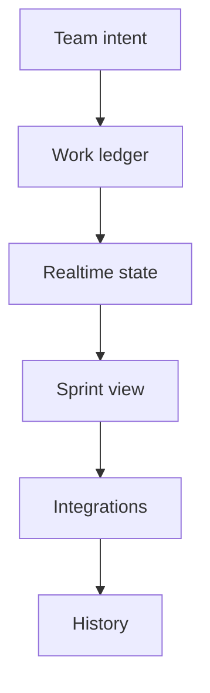

  

# Cadence work management

Cadence treats work as a sequence of commitments rather than an endless stream of cards. It is designed for small teams that need a calm shared view of what exists, what moved, and what needs attention.

[Discuss a similar system](mailto:ju@jomena.group?subject=Discuss%20Cadence%20work%20management) | [Book a technical call](mailto:ju@jomena.group?subject=Book%20a%20technical%20call%20about%20Cadence%20work%20management)

## The engineering problem

Most project tools optimise for adding work. The harder problem is preserving ownership and history while helping a team decide what deserves focus now.

## What the system covers

- Task and sprint ledgers
- Realtime team state
- Invitations and controlled access
- Change history and ownership
- Optional CRM synchronisation

## System shape

## Build notes

- Prefer a small set of meaningful states.
- Keep the history of a commitment after its board position changes.
- Use quiet defaults so the tool supports focus instead of competing for it.

Built under the Aryze umbrella. The underlying source and company IP remain private and owned by Aryze. Delivery involved people across engineering, product, operations, compliance, and design. Open-source foundations retain their original attribution and licences.

## Talk through a similar problem

If you are trying to build, untangle, or ship a system in this area, [send me a note](mailto:ju@jomena.group?subject=I%20need%20help%20with%20Cadence%20work%20management). If the problem needs a deeper technical conversation, [book a call by email](mailto:ju@jomena.group?subject=Book%20a%20technical%20call%20about%20Cadence%20work%20management).
