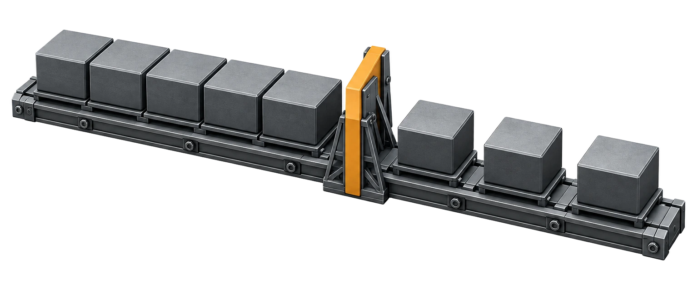
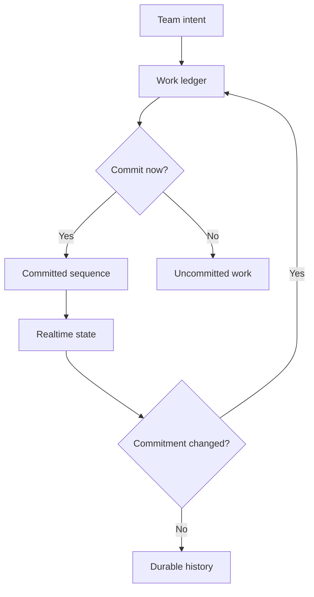

[← All work](https://github.com/J0UH) · [Money and operations systems](https://github.com/J0UH/money-operations-systems)

# Cadence work management

A personal work-management project for small teams that want a calmer view of their commitments.

Adding another task is easy. Knowing what the team has actually committed to, who owns it, and why it moved is harder. That is the part of work management I wanted Cadence to pay attention to.

Cadence treats tasks and sprints as a record of decisions over time. The current view matters, but so does the history behind it. Moving a card should not erase what was previously promised.

## Making changes understandable

The design uses a small set of meaningful states and a shared view of current work. When a commitment changes, the change belongs in the record so the next person can understand it without piecing together a separate conversation.

Team ownership, invitations, and access are part of that same product problem. People need to know which work is theirs and what they can change. Optional CRM synchronisation connects the work to customer context where it is useful.

I want the tool to support focus. That means quiet defaults, explicit commitments, and enough context to make the next decision without filling the screen with more activity.

## What the work covers

- Task and sprint ledgers
- Realtime team state
- Invitations and controlled access
- Change history and ownership
- Optional CRM synchronisation

A closer look at the technical flow

## Related work

- [Money and operations systems](https://github.com/J0UH/money-operations-systems)
- [Project intelligence and coordination](https://github.com/J0UH/project-intelligence-coordination)

Working on a similar problem? [Tell me what you are building](mailto:ju@jomena.group?subject=Cadence%20work%20management).

*This is a public account of the work. Source code and private operating details are not included in this repository.*
