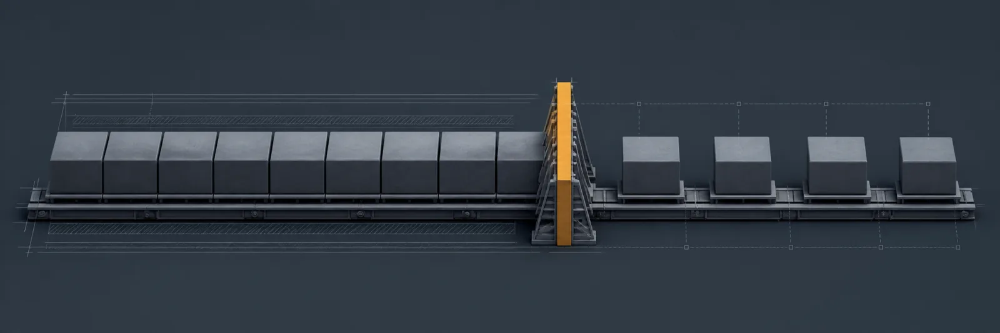
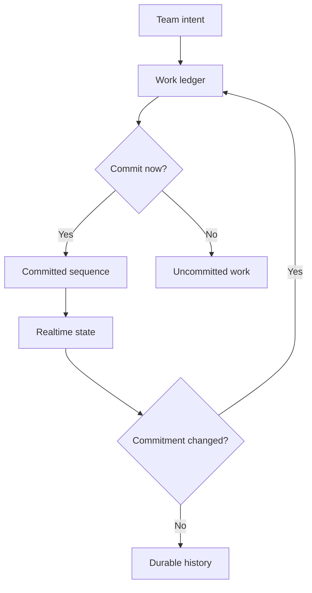

[← All systems](https://github.com/J0UH) · [Money and operations systems](https://github.com/J0UH/money-operations-systems)

  

# Cadence work management

Cadence treats work as a sequence of commitments rather than an endless stream of cards. It is designed for small teams that need a calm shared view of what exists, what moved, and what needs attention.

## The engineering problem

Most project tools optimise for adding work. The harder problem is preserving ownership and history while helping a team decide what deserves focus now.

## What the system covers

- Task and sprint ledgers
- Realtime team state
- Invitations and controlled access
- Change history and ownership
- Optional CRM synchronisation

## System shape

## Build notes

- Prefer a small set of meaningful states.
- Keep the history of a commitment after its board position changes.
- Use quiet defaults so the tool supports focus instead of competing for it.

Personal work. Public overview only. Source code, credentials, and private operating details are not included.

## Talk through a similar problem

Working on something similar? [Tell me about it](mailto:ju@jomena.group?subject=Cadence%20work%20management).
