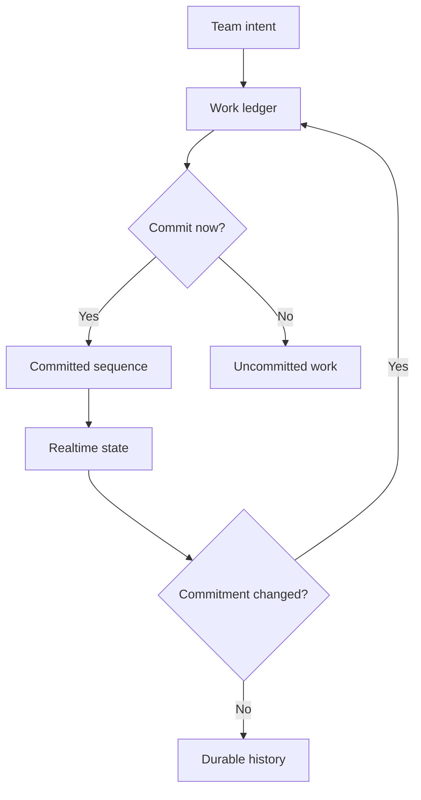

[← Profile](https://github.com/J0UH) · [Money and operations](https://github.com/J0UH/money-operations-systems)

# Cadence

A personal work-management project for small teams that want a calmer view of their commitments.

*Personal project. Source for related professional systems stays with the companies that own it — [about these pages](https://github.com/J0UH/J0UH/blob/main/ABOUT.md).*

## Problem

Adding another task is easy. Knowing what the team has actually committed to, who owns it, and why it moved is harder. Moving a card should not erase what was previously promised.

## What I built

Cadence treats tasks and sprints as a record of decisions over time: a small set of meaningful states, realtime team view, invitations and access, change history, and optional CRM context where it helps.

## Key decisions

- **Commitment is an explicit boundary.** Work crosses into a sprint on purpose; uncommitted work stays visible without pretending it was promised.
- **Changes return through the ledger.** Rewriting the plan silently is not allowed — history keeps the reason.
- **Quiet defaults, inspectable ownership.** Focus over activity noise.

## Architecture

## What the work covers

- Task and sprint ledgers
- Realtime team state
- Invitations and controlled access
- Change history and ownership
- Optional CRM synchronisation

## Related work

- [Money and operations systems](https://github.com/J0UH/money-operations-systems)
- [Personal AI employee](https://github.com/J0UH/personal-ai-employee)

Working on a similar problem? [Tell me what you are building](mailto:ju@jomena.group?subject=Cadence).
